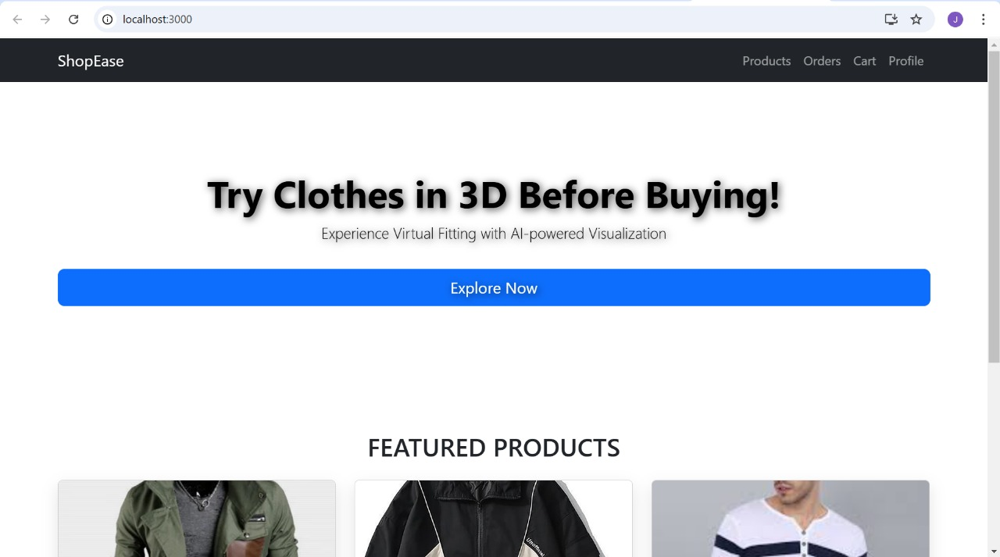
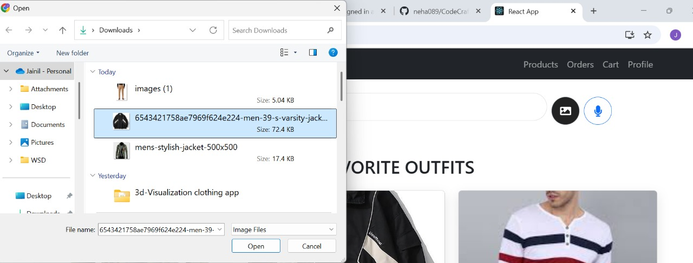
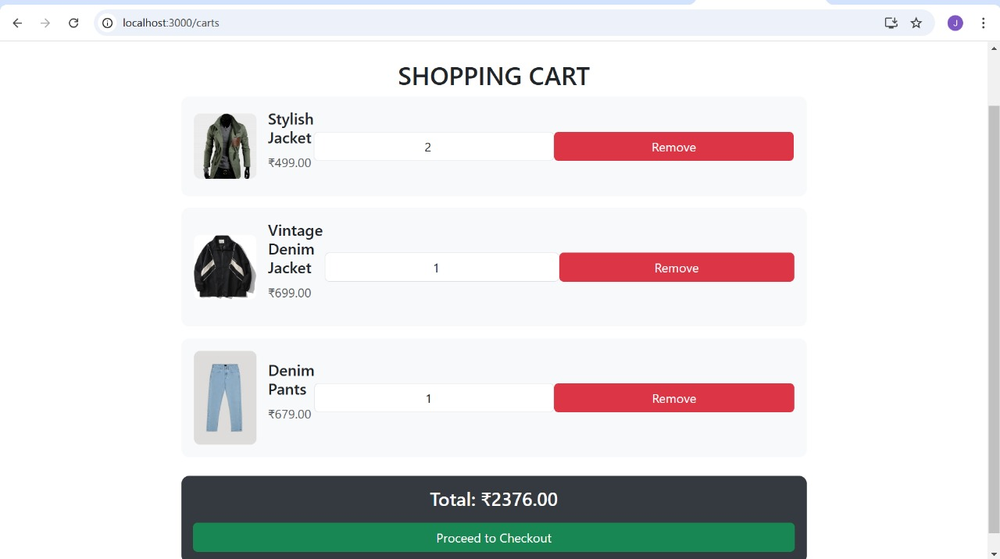

# CodeCrafters
# ShopEase - 2D Clothing Visualization & Virtual Try-On

ShopEase is an innovative e-commerce platform that transforms the way users shop for clothes.  AI-powered search (by image ), personalized recommendations, and a 2D virtual try-on feature, ShopEase offers a truly immersive shopping experience.

## Table of Contents

- [Features](#features)
- [Technologies Used](#technologies-used)
- [Installation](#installation)
  - [Backend Setup](#backend-setup)
  - [Frontend Setup](#frontend-setup)
- [Usage](#usage)
- [Project Structure](#project-structure)
- [Environment Variables](#environment-variables)
- [Contributing](#contributing)
- [License](#license)

## Features

- *2D Virtual Try-On:*  
  Visualize how clothes will look on you in a 2D simulated interface.

- *Advanced Search:*  
  - *Image Search:* Upload an image to find similar products.
  - *Voice Search:* Use voice commands to search for products.

- *AI-based Recommendations:*  
  Get personalized product recommendations based on your browsing and purchase history.

- *Product Management:*  
  Browse a comprehensive list of clothing products with detailed information (images, price, description).

- *Shopping Cart & Checkout:*  
  Easily add items to your cart, update quantities, and check out with multiple payment options (Card & Cash on Delivery).

- *Order Management:*  
  View your past orders on a dedicated "My Orders" page.

- *User Authentication:*  
  Secure login, registration, and profile management.

## Technologies Used

- *Frontend:* React, React Router, Axios, Bootstrap, Tailwind CSS (optional)
- *Backend:* Node.js, Express, MongoDB, Mongoose
- *AI/ML Components:* Custom or third-party services for image search, voice recognition, and recommendation systems.
- *Virtual Try-On:* Integration  2D simulation tools and models (U2net , SegGen , GMM).


##Screanshots


(./assets/based.jpg)



## Installation


### Backend Setup

1. *Clone the Repository:*

   ```bash
   git clone https://github.com/neha089/CodeCrafters.git
   cd backend
   npm install

### Frontend Setup
	
   cd frontend
   npm install
   npm start   

## Environment Variables

MONGO_URI=your_mongodb_connection_string
PORT=5000
JWT_SECRET=your_jwt_secret